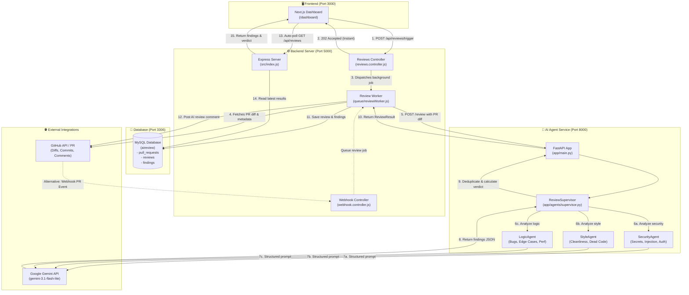

<div align="center">

# 🤖 Autonomous AI Code Reviewer

### Production-grade, multi-agent code analysis for GitHub Pull Requests

[](https://nextjs.org/)
[](https://nodejs.org/)
[](https://fastapi.tiangolo.com/)
[](https://python.org/)
[](https://ai.google.dev/)
[](https://mysql.com/)
[](https://tailwindcss.com/)
[](LICENSE)

<br />

**An intelligent, multi-agent code review platform that inspects GitHub Pull Requests in real time, flags security vulnerabilities, logic bugs and code-quality issues, stores line-by-line findings in MySQL, and automatically posts a review verdict back to the Pull Request on GitHub.**

[🎬 Video Demo](#-video-walkthrough--demo) •
[🌟 Features](#-key-features) •
[🏗️ Architecture](#-system-architecture) •
[🤖 Agents](#-specialized-agents) •
[🔄 How It Works](#-how-it-works-end-to-end-flow) •
[🚀 Quickstart](#-getting-started) •
[📡 API](#-api-reference) •
[🗄️ Database](#-database-schema)

</div>

---

## 📖 Table of Contents

1. [Overview](#-overview)
2. [Video Walkthrough & Demo](#-video-walkthrough--demo)
3. [Key Features](#-key-features)
4. [System Architecture](#-system-architecture)
5. [Specialized Agents](#-specialized-agents)
6. [How It Works (End-to-End Flow)](#-how-it-works-end-to-end-flow)
7. [The Background Worker](#-the-background-worker)
8. [Verdict Logic](#-verdict-logic)
9. [Database Schema](#-database-schema)
10. [Tech Stack](#-tech-stack)
11. [Project Structure](#-project-structure)
12. [Getting Started](#-getting-started)
13. [Running a Code Review](#-running-a-code-review)
14. [API Reference](#-api-reference)
15. [Performance](#-performance)
16. [Troubleshooting](#-troubleshooting)
17. [Contributing](#-contributing)
18. [License](#-license)

---

## 📌 Overview

Traditional code reviews are slow, inconsistent, and easy to rush. **Autonomous AI Code Reviewer** acts as a tireless first-pass reviewer for every Pull Request.

Whenever a PR is opened, updated, or manually submitted from the dashboard, the system:

1. Fetches the PR's unified Git diff from GitHub.
2. Sends it to a **multi-agent AI pipeline** (Security, Style, Logic) powered by Google Gemini.
3. Categorizes every issue with its **exact file, line number, severity, and a suggested fix**.
4. Saves everything to **MySQL** for history and analytics.
5. Posts a **markdown review comment** directly on the GitHub Pull Request.
6. Shows the findings and verdict on a **real-time Next.js dashboard**.

A full end-to-end review completes in roughly **8–10 seconds**.

---

## 🎬 Video Walkthrough & Demo

<div align="center">

<a href="https://drive.google.com/file/d/1D7J4HVVsdZhHHUjVcTXVAgfGWASnBp5d/view?usp=sharing" target="_blank">
  
</a>

<br /><br />

[](https://drive.google.com/file/d/1D7J4HVVsdZhHHUjVcTXVAgfGWASnBp5d/view?usp=sharing)

<em>👆 Click the thumbnail or the button to watch the full project explanation and live demo.</em>

</div>

**What the video covers:**

| ⏱️ Timestamp | 📌 Topic |
| :--- | :--- |
| `00:00 – 01:15` | **Introduction & Problem Statement** — why traditional code reviews fall short |
| `01:15 – 03:00` | **System Architecture** — Next.js + Express + FastAPI + MySQL |
| `03:00 – 05:00` | **Multi-Agent Deep Dive** — SecurityAgent, StyleAgent, LogicAgent |
| `05:00 – 07:30` | **Live Demo 1: Manual PR Trigger** — dashboard execution and ~10s review |
| `07:30 – 09:15` | **Live Demo 2: GitHub Webhook Automation** — `git push` to PR comment |
| `09:15 – 10:30` | **Database Schema & Resolution Workflow** |

> 💡 **Note:** GitHub cannot play Google Drive videos inline inside a README, so the thumbnail above opens the video in a new tab. Make sure the Drive file's sharing is set to **"Anyone with the link can view"**.

---

## 🌟 Key Features

### 🧠 AI Review Engine
- **🛡️ Tri-Agent Specialized Pipeline** — Dedicated **Security**, **Style**, and **Logic** agents review code independently, giving higher precision and fewer hallucinations than a single generic prompt.
- **👔 Supervisor Orchestration** — A `ReviewSupervisor` aggregates all agent reports, **deduplicates** overlapping issues, and computes the final verdict.
- **📐 Structured Output** — Gemini returns typed JSON validated by **Pydantic v2**, so every finding has a reliable file, line, severity, and message.
- **⚡ Sub-10-Second Reviews** — Fast structured generation delivers full multi-agent results in about 8–10 seconds without hitting rate limits.

### 🔄 Triggers & Automation
- **Automated Webhooks** — Listens to GitHub `pull_request` events (`opened`, `synchronize`) so every `git push` is reviewed automatically.
- **Interactive Dashboard** — Trigger an on-demand review from the web console with live progress polling.
- **💬 Automated GitHub Comments** — Posts a formatted markdown report (summary, agent breakdown, critical findings, verdict) into the PR conversation.

### 🔒 Reliability & Efficiency
- **Idempotency Guard** — Prevents duplicate runs for the same commit SHA, saving LLM tokens and avoiding redundant comments.
- **Instant `202 Accepted` Response** — The API acknowledges immediately and hands heavy work to a background worker, so neither GitHub webhooks nor the browser ever time out.
- **Atomic Database Writes** — Review, findings, and PR status are saved in a single transaction.
- **Force Re-review** — A manual trigger deletes the previous review for that commit and runs a fresh analysis.

### 📊 Dashboard & Analytics
- Visual charts powered by **Recharts**
- Severity badges: `Critical`, `High`, `Medium`, `Low`
- Verdict display: **REQUEST CHANGES**, **COMMENT**, **APPROVED**
- Line-by-line **diff inspection**
- **1-click issue resolution** (toggle findings as resolved/unresolved)
- Real-time status banners (⚙️ analysing → ✅ complete)

### 🔐 Authentication
- Optional **GitHub OAuth** (Passport.js) with **JWT** sessions
- Encrypted storage of user access tokens
- Webhook payloads verified with a shared secret

---

## 🏗️ System Architecture



### The Four Core Components

| Component | Directory | Port | Responsibility |
| :--- | :--- | :---: | :--- |
| **Frontend** | `client/` | `3000` | Next.js 14 dashboard where users trigger reviews and explore findings and charts |
| **Backend API** | `server/` | `5000` | Express.js server: handles webhooks, fetches diffs from GitHub, orchestrates the background worker |
| **AI Agent Service** | `agent-service/` | `8000` | Python FastAPI service running the three specialist agents through LangChain + Google Gemini |
| **Database** | MySQL | `3306` | Stores users, pull requests, reviews, and findings |

---

## 🤖 Specialized Agents

| Agent | Focus Area | Example Issues Detected |
| :--- | :--- | :--- |
| **🛡️ SecurityAgent** | Application security & credentials | Hardcoded passwords/API keys/tokens, SQL injection, IDOR, sensitive data leakage, unsafe deserialization |
| **🎨 StyleAgent** | Code hygiene & standards | Accidentally committed junk/debug text, syntax errors, deprecated constructs (`var` vs `const`), dead code, naming inconsistencies |
| **🧠 LogicAgent** | Correctness, edge cases & performance | Inverted boolean conditions, off-by-one errors, missing null/undefined checks, infinite loops, N+1 query patterns, performance regressions |
| **👔 ReviewSupervisor** | Orchestration & deduplication | Aggregates specialist reports, removes duplicate findings on the same line, calculates the final verdict |

Each agent sends a focused system prompt plus the PR diff to Gemini and receives a **structured Pydantic object** back — no free-form text parsing required.

---

## 🔄 How It Works (End-to-End Flow)

```text
User Click / GitHub Webhook
        ↓
Express Server (Node.js :5000)  ──► returns 202 Accepted immediately
        ↓  (Background Worker fetches diff from GitHub)
Agent Service (FastAPI :8000)
        ↓  (Supervisor → Security + Style + Logic Agents)
Google Gemini LLM
        ↓  (Structured JSON findings)
Save to MySQL (:3306) & Post comment to GitHub PR
        ↓  (Dashboard auto-polls every 2.5s)
Next.js Frontend (:3000) shows results
```

### Step 1 — Trigger
A review starts in one of two ways:
- **Manual:** the user clicks **"⚡ Review PR Now"** on the dashboard and enters a repository and PR number.
- **Webhook:** a developer opens a PR or pushes a new commit, and GitHub sends a `pull_request` event to `POST /api/webhook/github`.

### Step 2 — Instant Acknowledgement
The request reaches `triggerManualReview` in `reviews.controller.js` (or the webhook controller). Because an AI review takes 8–10 seconds, the server immediately returns **HTTP 202 Accepted**. This avoids browser/webhook timeouts and lets the UI show a progress banner: *"⚙️ AI agents are analysing your code…"*.

### Step 3 — Fetch the Diff
The background worker calls the GitHub REST API with your token:

```http
GET https://api.github.com/repos/{owner}/{repo}/pulls/{prNumber}
Accept: application/vnd.github.v3.diff
```

This returns the unified diff (added `+` and removed `-` lines) plus the list of changed files. The PR status is set to `reviewing`.

### Step 4 — Call the Agent Service
The worker forwards a payload to the FastAPI service:

```http
POST http://localhost:8000/review
{ "repo_url", "pr_number", "diff", "changed_files", "base_sha", "head_sha" }
```

### Step 5 — Multi-Agent Analysis
`ReviewSupervisor` invokes the **SecurityAgent**, **StyleAgent**, and **LogicAgent**. Each calls `gemini-3.1-flash-lite` and returns structured findings.

### Step 6 — Deduplicate & Decide
The supervisor merges findings, removes duplicates (same issue on the same line reported by multiple agents), and calculates the final [verdict](#-verdict-logic). FastAPI returns a `ReviewResult` to the worker.

### Step 7 — Persist to MySQL
In one **atomic transaction**, the worker:
- creates a row in `reviews` (verdict, summary, commit SHA),
- bulk-inserts all rows into `findings` (file, line, severity, message, agentType),
- sets `pull_requests.status = "completed"`.

### Step 8 — Comment on GitHub
The worker calls `postReviewComment` to add a markdown comment to the PR conversation, including the summary, agent breakdown, and critical findings.

### Step 9 — Dashboard Updates
`dashboard/page.jsx` polls `GET /api/reviews` every **2.5 seconds**. When the new review appears, the blue banner turns into a green *"✅ Review complete! Results are ready below."* and the list shows total findings, severity badges, and the verdict. Clicking a review reveals every line-by-line issue.

---

## ⚙️ The Background Worker

The worker (`server/src/queue/reviewWorker.js`) does all the heavy lifting so the API can respond instantly. Without it, GitHub webhooks (which do not wait ~10 seconds) and the browser would time out.

```text
        [Trigger: Manual or Webhook]
                      ↓
        ┌───────────────────────────┐
        │     Background Worker     │
        │  (queue/reviewWorker.js)  │
        └─────────────┬─────────────┘
                      │
  1. Idempotency guard (prevent duplicate reviews)
  2. Mark PR status as "reviewing"
  3. Download diff & changed files from GitHub
  4. Call the Python AI Agent Service (FastAPI)
  5. Save review & findings to MySQL
  6. Post AI review comment on the GitHub PR
  7. Mark PR status as "completed"
```

| # | Responsibility | Details |
| :-: | :--- | :--- |
| 1 | **Idempotency guard** | Checks whether this commit SHA was already reviewed. Duplicate webhook deliveries are skipped to save LLM quota. A *manual* trigger deletes the old review and runs a fresh analysis. |
| 2 | **Status update** | Sets `pull_requests.status = "reviewing"` so the dashboard knows work is in progress. |
| 3 | **Fetch diff** | Calls the GitHub API to download the exact unified diff and changed-file list. |
| 4 | **Run AI agents** | Packages the diff and sends it to `POST /review` on the FastAPI service. |
| 5 | **Persist results** | Writes `reviews`, `findings`, and updates `pull_requests` in one transaction. |
| 6 | **Post to GitHub** | Adds a markdown comment such as: *"🤖 AI Code Review Completed: 3 issues found (1 Critical, 2 Medium). Verdict: REQUEST CHANGES."* |

---

## ⚖️ Verdict Logic

| Condition | Verdict |
| :--- | :--- |
| At least one **Critical** or **High** finding | `request_changes` |
| Only lower-severity suggestions (Medium / Low) | `comment` |
| No findings | `approve` |

---

## 🗄️ Database Schema

The system uses **MySQL**, managed through the **Sequelize ORM**.

```text
users ───< (OAuth & connected repos)
             │
pull_requests ───< reviews ───< findings
(PR metadata)      (verdict,     (line-by-line issues,
                    summary)      severity, resolved status)
```

| Table | Purpose |
| :--- | :--- |
| **`users`** | GitHub OAuth profiles, encrypted access tokens, and tracked repository lists |
| **`pull_requests`** | Repository full name, PR number, author, status (`pending`, `reviewing`, `completed`), and latest reviewed commit SHA |
| **`reviews`** | One record per commit evaluation: `verdict` (`approve`, `request_changes`, `comment`), AI summary, and a composite unique key `(prId, triggeredBySha)` |
| **`findings`** | Line-by-line issues: `file`, 1-based `line`, `severity` (`critical`, `high`, `medium`, `low`), `agentType`, actionable fix `message`, and a `resolved` boolean |

---

## 🛠️ Tech Stack

| Layer | Technologies |
| :--- | :--- |
| **Frontend** | Next.js 14, React 18, TailwindCSS, Recharts, Axios |
| **Backend** | Node.js, Express.js 5, Sequelize ORM, MySQL2, Passport.js (GitHub strategy), JWT |
| **Agentic AI** | Python 3.12, FastAPI, LangChain, Google GenAI SDK (`gemini-3.1-flash-lite`), Pydantic v2 |
| **Database** | MySQL 8.0 |
| **DevOps & Tooling** | Nodemon, Uvicorn, LocalTunnel / ngrok, Git |

---

## 📁 Project Structure

```text
AI-Reviewer-PROJECT/
├── client/                         # Next.js 14 dashboard (port 3000)
│   └── src/app/dashboard/page.jsx  # Dashboard with polling & findings UI
├── server/                         # Express backend (port 5000)
│   └── src/
│       ├── index.js                # Server entry point
│       ├── controllers/
│       │   ├── reviews.controller.js
│       │   └── webhook.controller.js
│       ├── queue/
│       │   └── reviewWorker.js     # Background review worker
│       └── githubClient.js         # GitHub API helpers (diff, comments)
├── agent-service/                  # Python FastAPI AI service (port 8000)
│   └── app/
│       ├── main.py                 # FastAPI app & /review endpoint
│       └── agents/
│           └── supervisor.py       # ReviewSupervisor + specialist agents
└── README.md
```

> The tree above lists the key files referenced throughout this document; your repository may contain additional files and folders.

---

## 🚀 Getting Started

### Prerequisites

- [Node.js](https://nodejs.org/) v18.x or v20.x+
- [Python](https://www.python.org/) v3.11+ (3.12 recommended)
- [MySQL](https://www.mysql.com/) v8.0+
- A [Google Gemini API key](https://ai.google.dev/)
- A [GitHub Personal Access Token](https://github.com/settings/tokens) with `repo` permissions

### Step 1 — Clone the Repository

```bash
git clone https://github.com/YOUR_USERNAME/AI-Reviewer-PROJECT.git
cd AI-Reviewer-PROJECT
```

### Step 2 — Create the Database

```sql
CREATE DATABASE aireview CHARACTER SET utf8mb4 COLLATE utf8mb4_unicode_ci;
```

### Step 3 — Configure Environment Variables

#### Backend — `server/.env`

Create it from `server/.env.example`:

```env
PORT=5000
NODE_ENV=development

# MySQL Database
MYSQL_HOST=localhost
MYSQL_PORT=3306
MYSQL_USER=root
MYSQL_PASSWORD=your_mysql_password
MYSQL_DATABASE=aireview

# FastAPI Agent Service
FASTAPI_URL=http://localhost:8000

# GitHub Configuration
GITHUB_TOKEN=ghp_your_github_personal_access_token
GITHUB_WEBHOOK_SECRET=your_webhook_secret
WEBHOOK_PAYLOAD_URL=http://localhost:5000/api/webhook/github

# GitHub OAuth (optional for local development)
GITHUB_CLIENT_ID=your_client_id
GITHUB_CLIENT_SECRET=your_client_secret
GITHUB_CALLBACK_URL=http://localhost:5000/api/auth/github/callback

# JWT & Frontend
JWT_SECRET=your_jwt_secret_key
FRONTEND_URL=http://localhost:3000
```

#### AI Agent Service — `agent-service/.env`

```env
GEMINI_API_KEY=your_gemini_api_key
GEMINI_MODEL=gemini-3.1-flash-lite
PORT=8000
```

> ⚠️ **Never commit `.env` files or real tokens.** Make sure `.env` is listed in `.gitignore`.

### Step 4 — Start the Services (3 Terminals)

#### Terminal 1 — Python AI Agent Service

```bash
cd agent-service
python -m venv .venv

# Windows (PowerShell)
.\.venv\Scripts\activate
# Linux / macOS
# source .venv/bin/activate

pip install -r requirements.txt
uvicorn app.main:app --reload --port 8000
```

✅ **Verify:** open `http://localhost:8000/health` → `{"status": "healthy"}`

#### Terminal 2 — Node.js Express Backend

```bash
cd server
npm install
npm run dev
```

✅ **Verify:** open `http://localhost:5000/health` → `{"status": "healthy"}`

#### Terminal 3 — Next.js Dashboard

```bash
cd client
npm install
npm run dev
```

✅ **Verify:** open [http://localhost:3000/dashboard](http://localhost:3000/dashboard)

---

## ⚡ Running a Code Review

### Method A — Web Dashboard (Instant Manual Review)

1. Open `http://localhost:3000/dashboard`.
2. Click **"⚡ Review PR Now"** in the top navigation bar.
3. Enter the repository (`owner/repo`) and the PR number (e.g. `1`).
4. Click **"Start Review"**.
5. A loading banner appears and the dashboard polls every 2.5 seconds. Results show up in about **8–10 seconds**.

### Method B — Automated GitHub Webhook

1. In your GitHub repository, go to **Settings → Webhooks → Add webhook**.
2. Set the **Payload URL** to your server endpoint. For local development, expose port 5000 with [ngrok](https://ngrok.com/) or [localtunnel](https://localtunnel.me/):
   `https://your-tunnel.loca.lt/api/webhook/github`
3. Set **Content type** to `application/json`.
4. Set **Secret** to the same value as `GITHUB_WEBHOOK_SECRET` in `server/.env`.
5. Under events, choose **"Let me select individual events"** and check **Pull requests**.
6. From now on, every time a PR is opened or a new commit is pushed, the review runs automatically and a comment is posted on GitHub.

---

## 📡 API Reference

### Backend Server (`localhost:5000`)

| Method | Endpoint | Description |
| :---: | :--- | :--- |
| `GET` | `/health` | Server health check |
| `POST` | `/api/reviews/trigger` | Trigger an on-demand PR review (returns `202 Accepted`) |
| `GET` | `/api/reviews` | List all historical code reviews |
| `GET` | `/api/reviews/:prId` | Fetch the detailed review report and line-level findings |
| `GET` | `/api/reviews/:prId/diff` | Fetch the cached GitHub diff for visual comparison |
| `PATCH` | `/api/reviews/findings/:id/resolve` | Toggle a finding's resolution status (`resolved: true/false`) |
| `POST` | `/api/webhook/github` | Receive GitHub `pull_request` webhook deliveries |

**Example — trigger a review**

```bash
curl -X POST http://localhost:5000/api/reviews/trigger \
  -H "Content-Type: application/json" \
  -d '{"repo": "owner/repo", "prNumber": 1}'
```

> The request body field names above are illustrative — match them to your controller's expected payload.

### Agent Service (`localhost:8000`)

| Method | Endpoint | Description |
| :---: | :--- | :--- |
| `GET` | `/health` | Service health status |
| `POST` | `/review` | Accepts the PR diff and changed files, returns a structured `ReviewResponse` |

---

## ⏱️ Performance

| Step | Action | Component | Approx. Time |
| :--- | :--- | :--- | :---: |
| 1 | Trigger (button click or `git push`) | Next.js / GitHub | Instant |
| 2 | Acknowledge with `202 Accepted` | Express (`reviews.controller.js`) | ~200 ms |
| 3 | Fetch PR diff | GitHub REST API (`githubClient.js`) | ~1 s |
| 4 | Run Security, Style & Logic agents | FastAPI (`supervisor.py`) | ~6–8 s |
| 5 | LLM call (structured output) | Gemini `gemini-3.1-flash-lite` | ~1.5 s / agent |
| 6 | Save review & findings | MySQL (`reviewWorker.js`) | ~300 ms |
| 7 | Post markdown comment | GitHub API | ~500 ms |
| 8 | Dashboard auto-poll refresh | Next.js polling hook | ≤ 2.5 s |
| | **Total end-to-end** | | **~8–10 s** |

*Timings are approximate and depend on diff size, network latency, and API load.*

---

## 🧰 Troubleshooting

| Problem | Likely Cause & Fix |
| :--- | :--- |
| Dashboard stuck on "AI agents are analysing…" | Check that the FastAPI service is running on port 8000 and that `FASTAPI_URL` is correct. Check the worker logs in the server terminal. |
| `401` / `403` from GitHub | Your `GITHUB_TOKEN` is missing, expired, or lacks `repo` scope. |
| Webhook deliveries failing | Verify your tunnel (ngrok/localtunnel) is running, the Payload URL is correct, and the webhook **Secret** matches `GITHUB_WEBHOOK_SECRET`. |
| Webhook triggers but no new review | The idempotency guard skips commits that were already reviewed. Use the manual trigger to force a fresh review. |
| Gemini errors / empty findings | Confirm `GEMINI_API_KEY` and `GEMINI_MODEL` are set in `agent-service/.env`, and check your API quota. |
| MySQL connection refused | Make sure MySQL is running on port 3306 and the credentials in `server/.env` are correct. |
| Video thumbnail not loading | Set the Google Drive file's sharing to **"Anyone with the link"**. |

---

## 🤝 Contributing

Contributions are welcome!

1. Fork the repository.
2. Create a feature branch: `git checkout -b feature/amazing-feature`
3. Commit your changes: `git commit -m "Add amazing feature"`
4. Push the branch: `git push origin feature/amazing-feature`
5. Open a Pull Request — and let the AI reviewer take the first look. 😉

---


---

<div align="center">

**If this project helped you, consider giving it a ⭐ on GitHub!**

</div>
