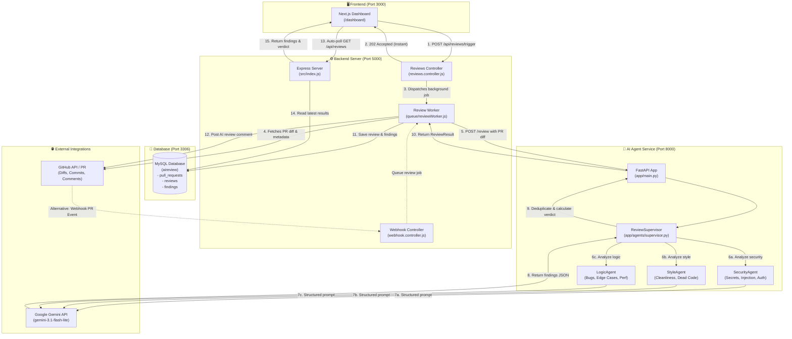

<div align="center">

# 🤖 Autonomous AI Code Reviewer

### *Production-Grade Multi-Agent Code Analysis for GitHub Pull Requests*

[](https://nextjs.org/)
[](https://nodejs.org/)
[](https://fastapi.tiangolo.com/)
[](https://python.org/)
[](https://ai.google.dev/)
[](https://mysql.com/)
[](https://tailwindcss.com/)
[](LICENSE)

<br />

**An intelligent, multi-agent code review platform that inspects GitHub Pull Requests in real time, flags security vulnerabilities, detects logical bugs and code cleanliness anti-patterns, stores line-by-line findings in MySQL, and automatically posts review verdicts back onto GitHub.**

[Explore Architecture](#-system-architecture) •
[Specialized Agents](#-specialized-agents) •
[Quickstart](#-getting-started) •
[API Reference](#-api-endpoints) •
[Database Schema](#-database-schema)

</div>

---

## 🌟 Key Features

* **🛡️ Tri-Agent Specialized Review Pipeline:** Instead of a generic prompt, dedicated agents (**Security**, **Style**, and **Logic**) review code independently for maximum precision and minimal hallucination.
* **⚡ Sub-10-Second Reviews:** Direct structured output generation delivers full multi-agent evaluations within **~8 to 10 seconds** without hitting rate limits.
* **🔄 Dual Review Triggers:**
  * **Automated Webhooks:** Listens to GitHub `pull_request` events (`opened`, `synchronize`) on every `git push`.
  * **Interactive Dashboard:** Manual on-demand review trigger via Next.js web console with real-time progress polling.
* **💬 Automated GitHub Comments:** Synthesizes markdown review reports directly into the GitHub PR conversation thread.
* **🔒 Idempotent & Rate-Limit Optimized:** Prevents duplicate runs for the same commit SHA, saving token costs and preventing redundant reviews.
* **📊 Comprehensive Analytics Dashboard:** Next.js dashboard featuring visual charts, severity badges (`Critical`, `High`, `Medium`, `Low`), diff inspection, and 1-click issue resolution.

---

## 🏗️ System Architecture



---

## 🤖 Specialized Agents

| Agent | Focus Area | Example Bugs Detected |
| :--- | :--- | :--- |
| **🛡️ SecurityAgent** | Application Security & Credentials | Plaintext passwords/tokens, SQL injection, IDOR, sensitive data leakage, dangerous deserialization |
| **🎨 StyleAgent** | Code Hygiene & Standards | Accidental debug text / keyboard smash, deprecated variables (`var` vs `const`), dead code, naming violations |
| **🧠 LogicAgent** | Correctness, Edge Cases & Performance | Inverted boolean conditions, off-by-one errors, missing null/undefined checks, infinite loops, N+1 query patterns |
| **👔 ReviewSupervisor** | Orchestration & Deduplication | Aggregates specialist reports, deduplicates overlapping issues, calculates final verdict (`approve` vs `request_changes`) |

---

## 🗄️ Database Schema

The system uses **MySQL** managed via **Sequelize ORM**:

```text
users ───< (OAuth & Connected Repos)
             │
pull_requests ───< reviews ───< findings
(PR Metadata)      (Verdict,     (Line-by-line Issues,
                    Summary)      Severity, Resolved Status)
```

* **`users`**: Stores GitHub OAuth profiles, encrypted access tokens, and tracked repository lists.
* **`pull_requests`**: Tracks repository full name, PR number, author, current status (`pending`, `reviewing`, `completed`), and latest reviewed commit SHA.
* **`reviews`**: One record per commit evaluation. Stores `verdict` (`approve`, `request_changes`, `comment`), high-level AI summary, and composite unique key `(prId, triggeredBySha)`.
* **`findings`**: Line-by-line issues with `file`, 1-based `line` number, `severity` (`critical`, `high`, `medium`, `low`), `agentType`, actionable fix `message`, and `resolved` boolean toggle.

---

## 🚀 Getting Started

### Prerequisites

Ensure you have installed:
* [Node.js](https://nodejs.org/) (v18.x or v20.x+)
* [Python](https://www.python.org/) (v3.11+ or v3.12+)
* [MySQL](https://www.mysql.com/) (v8.0+)
* A [Google Gemini API Key](https://ai.google.dev/)
* A [GitHub Personal Access Token](https://github.com/settings/tokens) (with `repo` permissions)

---

### Step 1: Clone Repository

```bash
git clone https://github.com/YOUR_USERNAME/AI-Reviewer-PROJECT.git
cd AI-Reviewer-PROJECT
```

---

### Step 2: Configure Environment Variables

#### 1. Backend Server (`server/.env`)
Create `server/.env` based on `server/.env.example`:
```env
PORT=5000
NODE_ENV=development

# MySQL Database
MYSQL_HOST=localhost
MYSQL_PORT=3306
MYSQL_USER=root
MYSQL_PASSWORD=your_mysql_password
MYSQL_DATABASE=aireview

# FastAPI Agent Service
FASTAPI_URL=http://localhost:8000

# GitHub Configuration
GITHUB_TOKEN=ghp_your_github_personal_access_token
GITHUB_WEBHOOK_SECRET=your_webhook_secret
WEBHOOK_PAYLOAD_URL=http://localhost:5000/api/webhook/github

# GitHub OAuth (Optional for local development)
GITHUB_CLIENT_ID=your_client_id
GITHUB_CLIENT_SECRET=your_client_secret
GITHUB_CALLBACK_URL=http://localhost:5000/api/auth/github/callback

# JWT & Frontend
JWT_SECRET=your_jwt_secret_key
FRONTEND_URL=http://localhost:3000
```

#### 2. AI Agent Service (`agent-service/.env`)
Create `agent-service/.env`:
```env
GEMINI_API_KEY=your_gemini_api_key
GEMINI_MODEL=gemini-3.1-flash-lite
PORT=8000
```

---

### Step 3: Start Services (3 Terminals)

#### Terminal 1: Python AI Agent Service
```powershell
cd agent-service
python -m venv .venv
.\.venv\Scripts\activate       # On Linux/macOS: source .venv/bin/activate
pip install -r requirements.txt
uvicorn app.main:app --reload --port 8000
```
> **Verify:** Navigate to `http://localhost:8000/health` → `{"status": "healthy"}`

#### Terminal 2: Node.js Express Backend
```powershell
cd server
npm install
npm run dev
```
> **Verify:** Navigate to `http://localhost:5000/health` → `{"status": "healthy"}`

#### Terminal 3: Next.js Client Dashboard
```powershell
cd client
npm install
npm run dev
```
> **Verify:** Open [http://localhost:3000/dashboard](http://localhost:3000/dashboard) in your browser.

---

## ⚡ How to Run a Code Review

### Method A: Via Web Dashboard (Instant Manual Review)
1. Open `http://localhost:3000/dashboard`.
2. Click **"⚡ Review PR Now"** in the top navigation bar.
3. Enter your repository (`owner/repo`) and PR Number (e.g. `1`).
4. Click **"Start Review"**.
5. The dashboard will show an instant loading banner and auto-poll every 2.5 seconds. Results appear within **~8 to 10 seconds**!

### Method B: Automated GitHub Push (Webhook)
1. In your GitHub repository, navigate to **Settings** → **Webhooks** → **Add Webhook**.
2. Set **Payload URL** to your server endpoint (use [ngrok](https://ngrok.com/) or [localtunnel](https://localtunnel.me/) for local development):
   `https://your-tunnel.loca.lt/api/webhook/github`
3. Content type: `application/json`.
4. Secret: Same as `GITHUB_WEBHOOK_SECRET` in `server/.env`.
5. Events: Select **"Let me select individual events"** → Check **Pull requests**.
6. Every time code is pushed or a PR is opened, the review runs automatically and comments on GitHub!

---

## 📡 API Endpoints

### Backend Server (`localhost:5000`)
| Method | Endpoint | Description |
| :--- | :--- | :--- |
| `GET` | `/health` | Server health check |
| `POST` | `/api/reviews/trigger` | Triggers on-demand manual PR review (Returns `202 Accepted`) |
| `GET` | `/api/reviews` | Lists all historical code reviews |
| `GET` | `/api/reviews/:prId` | Fetches detailed review report and line findings |
| `GET` | `/api/reviews/:prId/diff` | Fetches cached GitHub git diff for visual comparison |
| `PATCH`| `/api/reviews/findings/:id/resolve` | Toggles finding resolution status (`resolved: true/false`) |
| `POST` | `/api/webhook/github` | Handles GitHub pull request delivery events |

### Agent Service (`localhost:8000`)
| Method | Endpoint | Description |
| :--- | :--- | :--- |
| `GET` | `/health` | Service health status |
| `POST` | `/review` | Accepts PR diff & changed files, returns structured `ReviewResponse` |

---

## 🛠️ Tech Stack Breakdown

* **Frontend:** Next.js 14, React 18, TailwindCSS, Recharts (visual trend metrics), Axios.
* **Backend:** Node.js, Express.js 5, Sequelize ORM, MySQL2, Passport.js (GitHub Strategy), JWT.
* **Agentic AI:** Python 3.12, FastAPI, LangChain, Google GenAI SDK (`gemini-3.1-flash-lite`), Pydantic v2.
* **DevOps & Tooling:** Nodemon, Uvicorn, LocalTunnel, Git.

---

## 📄 License

This project is licensed under the [MIT License](LICENSE) — see the LICENSE file for details.
